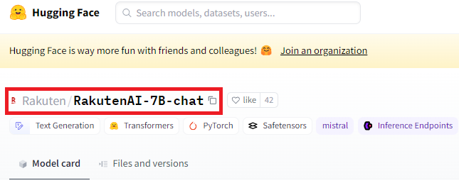

# LLM Quantize Sample

## What's me ?

HuggingFaceで公開されているモデルを量子化するためのサンプルスクリプト

llama.cppを使用してローカルLLMモデルを量子化する。

## 特徴

- ✅ ローカル環境にllama.cppをcloneする必要なし
- ✅ すべての処理がDockerコンテナ内で完結
- ✅ 再現性が高く、誰が実行しても同じ結果
- ✅ llama-quantize、llama-cliコマンドが利用可能

## Usage

Model IDと出力先を指定して実行する。オプションで量子化タイプも指定可能。

以下は楽天のモデルを例に量子化する。

HuggingFaceのページにアクセスするとModel IDが取得できる。

https://huggingface.co/Rakuten/RakutenAI-7B-chat



```bash
# 基本的な使い方 (デフォルトはq8_0)
$ sh quantize.sh Rakuten/RakutenAI-7B-chat Rakuten

# 量子化タイプを指定する場合
$ sh quantize.sh Rakuten/RakutenAI-7B-chat Rakuten q4_k_m

# 実行例の出力
download model
step 1: convert model to GGUF format (F16)
step 2: quantize model to q8_0
model quantize complete
output: Rakuten/model-q8_0.gguf

$ ls -lh Rakuten/ | grep model
-rw-r--r-- 1 root root  14G Jan 17 12:00 model-f16.gguf
-rw-r--r-- 1 root root 7.3G Jan 17 12:05 model-q8_0.gguf
```

### llama-cliコマンドの使用

量子化されたモデルは、コンテナ内のllama-cliコマンドで直接実行できる。

```bash
# 量子化されたモデルを実行
docker-compose run --rm quantize llama-cli -m Rakuten/model-q8_0.gguf -p "こんにちは" -n 128
```

### 量子化タイプについて

llama.cppでサポートされている主な量子化タイプ

- `q4_0`, `q4_1`: 4-bit量子化（サイズ小、速度速、品質低）
- `q5_0`, `q5_1`: 5-bit量子化（バランス型）
- `q8_0`: 8-bit量子化（サイズ大、速度遅、品質高）
- `q4_k_m`, `q5_k_m`: K-quants（推奨、品質とサイズのバランスが良い）
- `f16`: 16-bit浮動小数点（変換のみ、量子化なし）

詳細: https://github.com/ggerganov/llama.cpp#quantization

## References

https://github.com/ggerganov/llama.cpp/discussions/2948
